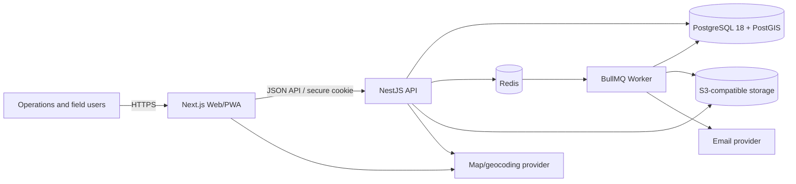

# System Context

The system boundary includes the web/PWA, API, worker, and their controlled data services.

## Diagram

## Trust boundaries

Browser input, uploaded files, provider responses, queue payloads, and email callbacks are untrusted. The API is the authorization boundary. Object storage and map tokens use least privilege; database and Redis are private network services.
